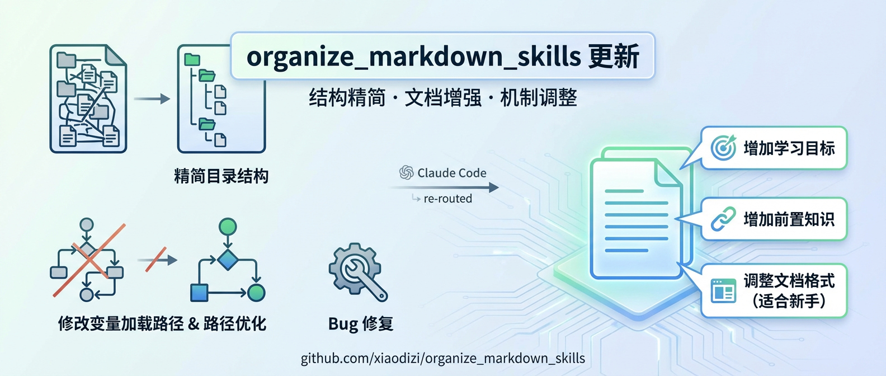

# Markdown Organizer

组织和美化从网页复制的 Markdown 文档，支持直接从 URL 转换网页为 Markdown，自动下载图片到本地并更新引用，利用 Claude 的智能思考生成学习目标和前置知识。



## ✨ 功能特性

| 功能 | 描述 |
|------|------|
| 🌐 **URL 转 Markdown** | 直接从网页 URL 获取内容并转换为清晰的 Markdown 文档 |
| 📥 **图片本地化** | 自动下载 Markdown 中的图片到 `img` 文件夹，使用 MD5 哈希命名避免冲突 |
| 🔗 **路径更新** | 将图片引用从网络 URL 自动更新为本地路径 `./img/filename.jpg` |
| 🎨 **格式美化** | 标题空行、列表规范化、删除多余空行，统一格式 |
| 🤖 **AI 内容增强** | Claude 智能生成学习目标、前置知识、FAQ（无需配置） |

## 🚀 快速开始

### 系统要求

- Python 3.6+
- Node.js 14.0+
- pip（Python包管理器）

### 安装

#### 通过 GitHub 安装（推荐，无需发布到 npm）

直接从 GitHub 仓库安装：

```bash
# 克隆仓库
git clone https://github.com/xiaodizi/organize_markdown_skills.git
cd organize_markdown_skills

# 方式一：全局安装（推荐）
npm link

# 方式二：直接运行安装向导
node bin/cli.js skills:add

# 方式三：通过 npx 运行（从GitHub）
npx github:xiaodizi/organize_markdown_skills skills:add
```

安装后，按照提示在 Claude Code 或 Gemini CLI 中完成插件配置。

### npx 直接使用三个命令（无需安装）

你也可以不安装，直接通过 npx 运行任意一个命令：

```bash
# 直接从 GitHub 运行
npx github:xiaodizi/organize_markdown_skills markdown-organizer input.md
npx github:xiaodizi/organize_markdown_skills url-to-markdown https://example.com output.md
npx github:xiaodizi/organize_markdown_skills wechat-format input.md output.html
```

> **说明**：本项目不需要发布到 npm 注册表，直接通过 GitHub 即可安装和使用。

#### Claude Code 插件安装

```bash
# 1. 添加市场源
/plugin marketplace add xiaodizi/organize_markdown_skills

# 2. 安装插件
/plugin install organize_markdown

# 3. 安装 Python 依赖（必须）
#    找到插件安装目录，一般在 ~/.claude/plugins/cache/organize_markdown/organize_markdown/<version>/
cd ~/.claude/plugins/cache/organize_markdown/organize_markdown/[version]/
pip install -r requirements.txt
```

#### Gemini CLI 安装

```bash
# 安装 skill（会自动发现 .gemini/skills 目录）
gemini skills install https://github.com/xiaodizi/organize_markdown_skills.git

# 或者指定具体路径安装
gemini skills install https://github.com/xiaodizi/organize_markdown_skills.git --path .gemini/skills/markdown-organizer
```

##### Gemini CLI 使用

```bash
# 查看已安装的 skills
gemini skills list

# 在 Gemini CLI 会话中直接使用完整命令（注意：Gemini CLI 不支持 "/" 命令自动补全）
/markdown-organizer @文件路径 [base_url]
/url-to-markdown <URL> [输出文件路径]

# 或者使用自然语言
# "帮我美化这个 markdown 文档"
# "把这个网页保存为 markdown"
```

> **重要提示**：Google Gemini CLI (v0.32.1) 不支持 Claude Code 的 "/" 命令自动补全功能。安装技能后，您需要直接输入完整的命令（如 `/markdown-organizer`）来使用功能，而不是期望输入 "/" 后显示命令列表。

### 使用

#### markdown-organizer - 美化现有 Markdown 文档

```bash
# 基本用法
/markdown-organizer @/path/to/article.md

# 处理相对路径图片（需要提供原网页 URL）
/markdown-organizer @article.md https://example.com/post/123
```

#### url-to-markdown - 从 URL 直接转换为 Markdown

```bash
# 基本用法（自动生成文件名）
/url-to-markdown https://example.com/post/123

# 指定输出文件路径
/url-to-markdown https://example.com/post/123 ./docs/article.md
```

### 自然语言触发

**markdown-organizer**:
- `"@文件路径 帮我美化文档"`
- `"处理这个 markdown 文件"`

**url-to-markdown**:
- `"把这个网页保存为 markdown"`
- `"将 URL 转换为 markdown 文档"`

### 命令行直接使用（新增）

安装后可以直接在终端使用三个独立命令：

```bash
# markdown-organizer - 组织和美化现有 Markdown 文档
npx markdown-organizer input.md
npx markdown-organizer input.md https://example.com/post

# url-to-markdown - 从 URL 转换为 Markdown
npx url-to-markdown https://example.com/post/123
npx url-to-markdown https://example.com/post/123 output.md
npx url-to-markdown https://example.com/post/123 output.md --render  # 启用 JS 渲染

# wechat-format - Markdown 转换为微信公众号 HTML
npx wechat-format input.md
npx wechat-format input.md output.html
```

如果你使用 `npm link` 全局安装，可以省略 `npx`：

```bash
# 全局安装后直接使用
markdown-organizer ./article.md
url-to-markdown https://example.com/article article.md
wechat-format article.md article.html
```

## 📖 详细说明

### 安装方式对比

| 安装方式 | 适用场景 | 命令 |
|---------|---------|------|
| **GitHub + npm link** | 开发环境、本地测试 | `git clone` + `npm link` → 三个命令全局可用 |
| **npx from GitHub** | 临时使用、CI/CD | `npx github:xiaodizi/organize_markdown_skills [command]` → 直接运行无需安装 |
| **Claude Code Plugin** | Claude Code AI 辅助使用 | `/plugin install` → 在 Claude Code 会话中使用斜杠命令 |
| **Gemini CLI** | Gemini CLI AI 辅助使用 | `gemini skills install` → 在 Gemini CLI 会话中使用斜杠命令 |

### 更新日志

| 版本 | 说明 |
|------|------|
| v1.0.7 | 新增 wechat-format 技能，支持将 Markdown 转换为微信公众号 HTML 格式、新增三个独立系统命令 `markdown-organizer`/`url-to-markdown`/`wechat-format` 支持 npx 直接调用 |
| v1.0.6 | 新增 url-to-markdown 技能，支持直接从 URL 转换网页为 Markdown、新增依赖 beautifulsoup4 和 html2text |
| v1.0.5 | 新增 npm/npx 安装方式支持、`npx skills-add-organize-markdown` 命令、优化安装体验 |
| v1.0.4 | 新增 Gemini CLI 技能支持、直接执行命令 `/organize`、优化文档结构 |
| v1.0.2 | Claude 智能思考生成学习目标和前置知识（无需配置）、自动更新检查 |
| v1.0.1 | 精简目录结构，优化变量加载路径 |
| v1.0.0 | 初始版本发布 |

当您运行命令时，Claude 会：

1. **阅读并分析**目标文档内容
2. **智能生成**：
   - 学习目标（4-6个，基于文档主题和章节）
   - 前置知识（识别相关技术栈）
   - FAQ（如文档是教程类型）
3. **自动插入**内容到文档开头
4. **执行脚本**下载图片和美化格式

所有内容生成由 Claude 智能完成，**无需任何 API 配置**。

### 图片处理

- 支持 `` 和 `` 语法
- 相对路径图片会自动与 `base_url` 组合
- 图片保存为 `img/[md5hash].jpg`
- 已下载的图片不会重复下载

## 📂 项目结构

```
organize_markdown_skills/
├── .claude-plugin/                   # 插件配置（发布时由 GitHub 读取）
│   ├── plugin.json                   # 插件元数据（名称、版本、命令、技能等）
│   └── marketplace.json              # 市场配置（发布到插件市场）
├── .gemini/                          # Gemini CLI 配置
│   ├── commands/
│   │   ├── organize.md               # /organize 命令定义
│   │   └── url-to-markdown.md        # /url-to-markdown 命令定义
│   └── skills/
│       ├── markdown-organizer/       # Gemini CLI Skill - markdown 美化
│       │   ├── SKILL.md              # 技能说明
│       │   └── scripts/               # Python 脚本
│       └── url-to-markdown/          # Gemini CLI Skill - URL 转 markdown
│           ├── SKILL.md              # 技能说明
│           └── scripts/               # Python 脚本
├── bin/                              # npm CLI 工具
│   ├── cli.js                        # 主 CLI 入口
│   ├── skills-add.js                 # 技能安装向导
│   ├── markdown-organizer.js         # 独立命令：markdown 美化
│   ├── url-to-markdown.js            # 独立命令：URL 转 markdown
│   └── wechat-format.js              # 独立命令：markdown 转微信 HTML
├── scripts/                          # npm 脚本
│   └── postinstall.js                # npm install 后自动运行
├── commands/                         # 命令快捷方式
│   ├── markdown-organizer.md         # /markdown-organizer 命令定义
│   └── url-to-markdown.md            # /url-to-markdown 命令定义
├── hooks/                            # 插件钩子
│   ├── hooks.json                    # 钩子配置
│   ├── check-deps.sh                 # 依赖检查（会话启动时自动安装 requests）
│   └── check-update.sh               # 更新检查（会话启动时检查新版本）
├── skills/                           # Claude Code 技能定义
│   ├── markdown-organizer/
│   │   ├── SKILL.md                  # 技能说明（Claude 执行时的指导）
│   │   └── scripts/                   # Python 脚本
│   │       ├── organize_markdown.py   # 图片下载与格式美化
│   │       └── enhance_content.py     # 内容增强（备用，AI 智能思考替代）
│   └── url-to-markdown/
│       ├── SKILL.md                  # 技能说明（Claude 执行时的指导）
│       └── scripts/
│           └── url_to_markdown.py     # URL 转 Markdown 脚本
├── img/                              # 项目资源
│   └── f5339aeb70e245d782f288ba17ace4ff.jpg  # 插件预览图
├── package.json                      # npm 包配置
├── .npmignore                        # npm 发布忽略文件
└── README.md                         # 项目说明文档
```

## 🔄 更新机制

插件支持自动更新检查：

- **自动检查**：每次 Claude Code 会话启动时自动检查新版本
- **手动更新**：
  ```bash
  /plugin update organize_markdown@markdown-organizer
  ```


### 可选：渲染动态页面（Playwright）

对于使用 JavaScript 客户端渲染（如 React/Next/Vue）的页面，建议使用 `--render` 模式在无头浏览器中渲染页面后再抓取，这样可以获取由 JS 动态生成的正文和图片。

**安装：**
```bash
pip install playwright
playwright install
```

**使用示例：**
```bash
# 基础用法（等待网络空闲）
python skills/url-to-markdown/scripts/url_to_markdown.py https://example.com/post/123 --render

# 等待特定元素出现后再抓取
python skills/url-to-markdown/scripts/url_to_markdown.py https://react-site.com/article --render --render-wait-for ".article-content"

# 指定超时时间（毫秒）
python skills/url-to-markdown/scripts/url_to_markdown.py https://spa-app.com/page --render --render-timeout 60000

# 完整示例
python skills/url-to-markdown/scripts/url_to_markdown.py https://example.com/post/123 --render --render-wait-for "#article" --render-timeout 40000
```

**参数说明：**

| 参数 | 说明 |
|------|------|
| `--render` | 启用无头浏览器渲染模式 |
| `--render-wait-for` | 等待指定 CSS 选择器出现后再抓取 |
| `--render-wait-until` | 页面加载策略：`load`/`domcontentloaded`/`networkidle`（默认） |
| `--render-timeout` | 超时时间（毫秒，默认 30000） |

> 💡 如果未安装 Playwright，脚本会自动回退到普通请求模式并打印提示信息。

## ⚙️ 依赖

### Python 依赖
```bash
pip install requests beautifulsoup4 html2text
```

依赖会在插件安装后自动检查和安装。

### 自动依赖管理
- 插件启动时会自动检查并安装缺失的依赖
- 支持离线环境（需预先安装依赖）

## 🗑️ 卸载

### Claude Code 插件卸载

Claude Code 插件的卸载需要根据安装方式进行不同的操作：

#### 方法一：通过 `/plugin install` 安装的插件
```bash
# 1. 查看已安装的插件列表
/plugin list
